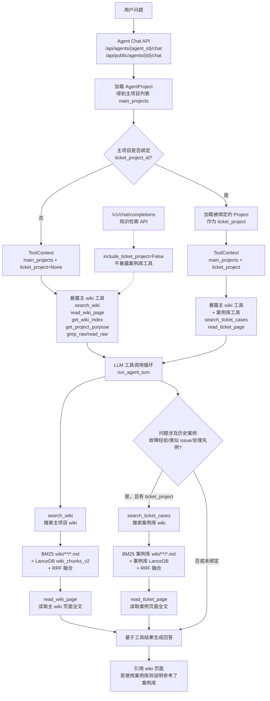

# LLM Wiki Engine

纯后端 LLM 知识编译引擎 — **Compile-time Knowledge Synthesis**。

不同于传统 RAG（chunk → embedding → 检索原文），本引擎先将原始文档通过 LLM **两步编译** 为结构化 Markdown 知识单元（entity / concept / source summary），再基于高质量知识页面提供检索、问答、Agent 与反馈修正 API。

> 完整栈（UI + 可选案例生成服务）请使用仓库根目录的 `docker-compose.yml` 或 `./start-dev.sh`。本文档侧重 **单独运行 engine** 或 API 集成。

## 核心能力

- **两步 CoT Ingest** — Analysis → Generation → FILE 块解析 → LLM 辅助页面合并 → SHA256 增量缓存 → 步骤级 checkpoint
- **Git 仓库同步** — 项目级绑定远端仓库；拉取 `raw/sources/` → 编译 → 提交推送 `raw/` + `wiki/`；APScheduler 每日定时
- **混合搜索** — BM25 + LanceDB 向量 + RRF 融合
- **RAG Chat (SSE)** — 混合搜索 → 图谱 1-hop 扩展 → 流式响应
- **反馈修正** — 对话质量评估 → 编译修复候选 → 人工审核 → 写回 Wiki（含本地 Git 快照回滚）
- **多项目隔离** — 独立 `disk_path` + LanceDB；per-project ingest / git sync 串行锁
- **多用户** — JWT + 项目成员角色；用户 API Token
- **自定义 Agent** — 多项目绑定、工具调用、公开 Chat 端点
- **文档** — 多格式解析；`raw/sources/` 递归列表与内容预览 API

## 快速开始

### 前置条件

- Python >= 3.10
- [uv](https://docs.astral.sh/uv/)（推荐）或 pip
- LLM API Key（OpenAI 兼容 / Ollama 等）
- **Git CLI**（Git 同步与 feedback 写盘快照需要）

### 本地开发（推荐从仓库根目录）

```bash
# 在 llmwiki 根目录
./start-dev.sh
```

Engine 会使用 `data/wiki` 与 `data/engine-db/engine.db`。

### 仅启动 engine（本子目录）

```bash
cd llm-wiki-engine
uv sync
cp .env.example .env   # 可选，根目录 .env 亦可

# 建议指定数据目录（与 monorepo 一致）
export PROJECTS_DIR=../data/wiki
export DATABASE_URL=sqlite+aiosqlite:///$(pwd)/../data/engine-db/engine.db
mkdir -p ../data/wiki ../data/engine-db

uv run uvicorn app.main:app --reload --host 0.0.0.0 --port 8000
```

- API 文档：http://localhost:8000/docs  
- 健康检查：http://localhost:8000/health  

### 启动 Runtime（单知识库只读推理）

Runtime 是面向分发的本地只读查询入口，不启动 DB、用户系统、编译队列、反馈或 Git 同步。它读取 `runtime-config.example.yaml` 格式的本地配置，消费已经由完整 engine 生成的 `wiki/`、`.llm-wiki/lancedb/` 和案例库 `.llm-wiki/case-index/`。

```bash
cd llm-wiki-engine
cp runtime-config.example.yaml runtime-config.yaml
# 编辑 runtime-config.yaml：knowledge.path、case_library.path、LLM/Embedding 配置

uv run python -m app.runtime_main --config ./runtime-config.yaml
```

默认地址：http://127.0.0.1:8012

Runtime 提供：

```
GET  /api/status
POST /api/chat                  # SSE 流式 + 非流式
POST /api/search
GET  /api/wiki
GET  /api/wiki/{path}
GET  /api/cases/{case_id}
GET  /v1/models
POST /v1/chat/completions       # 支持 stream=true
```

Runtime 自带的网页由相邻仓库 `../llm-wiki-ui` 的 runtime 专用入口构建而来。若本地存在该目录，打包脚本会先执行 `npm --prefix ../llm-wiki-ui run build:runtime` 并刷新 `app/runtime/ui_dist`；若只想使用当前已生成的静态产物，可设置 `SKIP_RUNTIME_UI_BUILD=1`。

### 打包 Runtime 单文件

本地平台打包：

```bash
cd llm-wiki-engine
./scripts/build-runtime.sh
```

Windows 使用：

```bat
scripts\build-runtime.bat
```

产物位于 `dist/runtime/<platform>/llm-wiki-runtime`（Windows 为 `.exe`）。

### Docker（单服务，开发用）

本子目录含独立 `docker-compose.yml`，仅启动 engine，数据卷为 `./projects`：

```bash
cd llm-wiki-engine
cp .env.example .env
docker compose up -d
```

生产/联调请用**根目录** `docker compose`（含 UI、持久化 `data/`）。

## 配置

| 环境变量 | 说明 | 默认值 |
|----------|------|--------|
| `LLM_API_KEY` | LLM API Key | （空） |
| `EMBEDDING_API_KEY` | Embedding API Key | （空） |
| `JWT_SECRET` | JWT 签名密钥 | `change-me-in-production` |
| `ADMIN_PASSWORD` | 管理员密码 | `admin` |
| `PROJECTS_DIR` | 项目磁盘根目录 | `./projects`（config 默认） |
| `DATABASE_URL` | SQLite 连接串 | `sqlite+aiosqlite:///./data/engine.db` |
| `CONFIG_PATH` | `config.yaml` 路径 | 可选 |

`config.yaml` 是本地私有配置，不提交到 Git。首次使用请复制模板：

```bash
cp config.example.yaml config.yaml
```

模板示例：

```yaml
llm:
  provider: "openai"
  model: "gpt-4o-mini"
  api_base: null

embedding:
  enabled: true
  provider: "openai"
  model: "text-embedding-3-small"
  dimensions: 1536
```

Admin API 可将部分配置写入 DB 覆盖 YAML。

## API 概览

### 认证

```
POST /api/auth/register
POST /api/auth/login
GET  /api/auth/me
GET  /api/auth/api-token
POST /api/auth/api-token/regenerate
```

### 项目

```
POST   /api/projects
GET    /api/projects
GET    /api/projects/{id}
PATCH  /api/projects/{id}          # 含 Git 同步字段、案例库绑定、反馈开关
DELETE /api/projects/{id}
POST   /api/projects/{id}/members
GET    /api/projects/{id}/members
```

### Git 同步（项目级）

```
POST /api/projects/{id}/git/test     # 测试仓库连接（owner）
POST /api/projects/{id}/git/sync     # 立即同步（成员）
GET  /api/projects/{id}/git/status   # 最近同步状态
```

`PATCH` 项目时可设置：`git_repo_url`、`git_branch`、`git_username`、`git_auth_token`（只写）、`clear_git_auth_token`、`git_sync_enabled`、`git_sync_time` 等。响应含 `git_auth_configured`，不返回 token 明文。

### 文档

```
POST /api/projects/{id}/documents/upload
GET  /api/projects/{id}/documents              # 递归列出 raw/sources/
GET  /api/projects/{id}/documents/content/{path} # 预览正文（PlainText）
```

### 编译（Ingest）

```
POST   /api/projects/{id}/ingest
POST   /api/projects/{id}/ingest/{job_id}/retry
GET    /api/projects/{id}/ingest/status
GET    /api/projects/{id}/ingest/history
DELETE /api/projects/{id}/ingest/{job_id}
```

### Wiki / 搜索 / Chat

```
GET  /api/projects/{id}/wiki
GET  /api/projects/{id}/wiki/overview
GET  /api/projects/{id}/wiki/graph
GET  /api/projects/{id}/wiki/{path}
PUT  /api/projects/{id}/wiki/{path}
POST /api/projects/{id}/search
POST /api/projects/{id}/chat              # SSE
GET  /api/projects/{id}/conversations
```

### 反馈

```
GET  /api/projects/{id}/feedback
POST /api/projects/{id}/feedback/{task_id}/review
POST /api/projects/{id}/feedback/{task_id}/apply
...
```

### 知识检索 API（OpenAI 兼容）

提供 `/v1/chat/completions` 端点，供外部系统（如案例生成 Fact Agent）以标准 OpenAI SDK / LiteLLM 方式查询项目知识库。

```
GET  /v1/models                 # 列出所有启用的虚拟模型名
POST /v1/chat/completions       # 知识检索补全（非流式）
```

**项目配置 API**（owner 权限）：

```
GET   /api/projects/{id}/knowledge-api
PATCH /api/projects/{id}/knowledge-api
POST  /api/projects/{id}/knowledge-api/regenerate-token
```

#### 快路径与慢路径

请求到达 `/v1/chat/completions` 后，引擎按以下优先级尝试路由：

1. **快路径（无 LLM，低延迟）** — 满足以下任一条件时触发：
   - 用户消息匹配短查询启发式（`什么是 X`、`X 的定义`、≤6 词的纯名词短语等）
   - 在 `wiki/entities/` 或 `wiki/concepts/` 下按 slug 或 frontmatter title 精确命中
   - BM25 搜索在概念/实体页中 top-1 score 超过阈值
   
   快路径直接截取命中页面的"定义 / 概述 / 简介"章节返回，不调用 LLM。

2. **慢路径（Agent tool-calling loop）** — 当快路径未命中时自动触发：
   - 消息是复杂问题（多句描述、含问号、超 6 词）
   - 或虽是简短查询但知识库中没有对应的 entity/concept 页面
   
   慢路径复用项目的 knowledge Agent（自动创建），执行完整的 `search_wiki` → `read_wiki_page` → `grep_raw` 工具循环，最终将 Agent 生成的文本作为 `choices[0].message.content` 返回。
   
   **关键约束**：慢路径始终设置 `include_ticket_project=False`，即使项目绑定了案例库也不暴露 `search_ticket_cases` / `read_ticket_page` 工具，防止与外部案例生成服务产出的案例形成循环引用。

#### 调用示例

```bash
curl -X POST "http://engine:8000/v1/chat/completions" \
  -H "Authorization: Bearer lwu_YOUR_TOKEN" \
  -H "Content-Type: application/json" \
  -d '{
    "model": "your-virtual-model-name",
    "messages": [{"role": "user", "content": "EDLA 和 GMS 有什么差异"}]
  }'
```

**限制**：不支持客户端传入 `tools`/`tool_choice`/`functions`（返回 400）；暂不支持 `stream: true`。

### Agent / Admin

```
/api/agents/...
/api/public/agents/{id}/chat    # 公开 SSE
/api/admin/...                  # 系统配置（admin）
```

### 主 Wiki 与案例库绑定

案例库不是独立的数据表，也不会混入主 wiki 的索引。它本质上是另一个普通 Project，通过主项目的 `ticket_project_id` 字段绑定：

- `Project.ticket_project_id` 指向另一个 `projects.id`，被指向的项目就是案例库。
- owner 可通过 `PATCH /api/projects/{id}` 设置或清空 `ticket_project_id`。
- 设置绑定时会校验当前用户也能访问目标案例项目。
- 不允许项目绑定自己，也不允许案例库再绑定另一个案例库，避免递归链。

主 Agent 与案例库的运行时链路：



Agent 回复问题时走工具调用链路：

1. Agent 通过 `AgentProject` 取得可访问的主项目列表。
2. `agent_toolcall_chat()` 从这些主项目中查找第一个已绑定的 `ticket_project_id`，加载对应案例库项目。
3. 运行时构造 `ToolContext(main_projects=..., ticket_project=...)`。
4. 如果 `ticket_project` 存在，才会向 LLM 暴露 `search_ticket_cases` 和 `read_ticket_page`。
5. 系统提示词会引导模型：当问题涉及历史案例、具体故障经验、类似 issue、处理先例时，可主动调用 `search_ticket_cases`。

`search_ticket_cases` 的实现逻辑：

```python
if name == "search_ticket_cases":
    if ctx.ticket_project is None:
        return {"error": "Ticket wiki not configured for this project."}
    query = arguments.get("query", "")
    limit = min(arguments.get("limit", 5), 10)
    return await _do_search(ctx.ticket_project, query, limit, "ticket")
```

它对案例库项目执行与主 wiki 相同的 hybrid search：

- `search_bm25(project.disk_path, query, top_k=limit * 2)` 扫描案例库项目的 `wiki/**/*.md`。
- `search_vector(project.disk_path, query, top_k=limit * 2)` 搜案例库项目自己的 `.llm-wiki/lancedb/wiki_chunks_v2`。
- `rrf_fusion(kw, vec, query)` 融合 BM25 与向量结果。
- 返回 `path`、`title`、`snippet`、`score`；当 `source_type == "ticket"` 时额外返回 `project_id` 和 `project_name`。

`read_ticket_page` 的实现逻辑：

```python
if name == "read_ticket_page":
    if ctx.ticket_project is None:
        return {"error": "Ticket wiki not configured for this project."}
    page_path = arguments.get("path", "")
    return await _do_read(ctx.ticket_project, page_path, "ticket")
```

它从案例库项目磁盘目录读取指定 wiki 页面：

- 拒绝包含 `..` 或以 `/` 开头的路径，避免越权读文件。
- 实际读取路径为 `Path(ctx.ticket_project.disk_path) / page_path`。
- 返回内容最多截断到 `MAX_PAGE_CHARS = 12000`。
- 从页面前 10 行解析 `# Heading` 或 `title:` 作为标题。
- 返回 `source_type: "ticket"`、`path`、`title`、`content`。

因此，主 wiki Agent 并不是后端自动把案例库内容拼进 prompt，而是根据绑定关系额外暴露案例库工具；是否搜索案例库由 LLM 在工具循环中决定。例外是 `/v1/chat/completions` 知识检索 API：慢路径会显式禁用案例库工具（`include_ticket_project=False`），防止案例生成流程形成循环引用。

## 项目磁盘布局

每个项目在 `PROJECTS_DIR/<uuid>/`：

```
purpose.md
raw/sources/          # 原始文档（上传 / Git 同步）
wiki/                 # 编译产物
.llm-wiki/            # ingest-cache、LanceDB、checkpoints 等
```

## 测试

```bash
cd llm-wiki-engine
uv sync
uv pip install pytest pytest-asyncio   # 若 venv 未带 dev 依赖
uv run pytest -v
```

## 项目结构

```
llm-wiki-engine/
├── pyproject.toml
├── config.example.yaml
├── Dockerfile
├── docker-compose.yml      # 仅 engine 单服务
├── .env.example
└── app/
    ├── main.py
    ├── config.py
    ├── database.py
    ├── auth/
    ├── projects/           # CRUD + git_sync.py + 调度注册
    ├── documents/
    ├── ingest/
    ├── embedding/
    ├── search/
    ├── wiki/
    ├── chat/
    ├── agents/
    ├── knowledge/          # 知识检索（快路径 + 慢路径编排）
    ├── openai_compat/      # /v1/ OpenAI 兼容端点
    ├── feedback/
    ├── admin/
    └── llm/
```

## License

MIT
